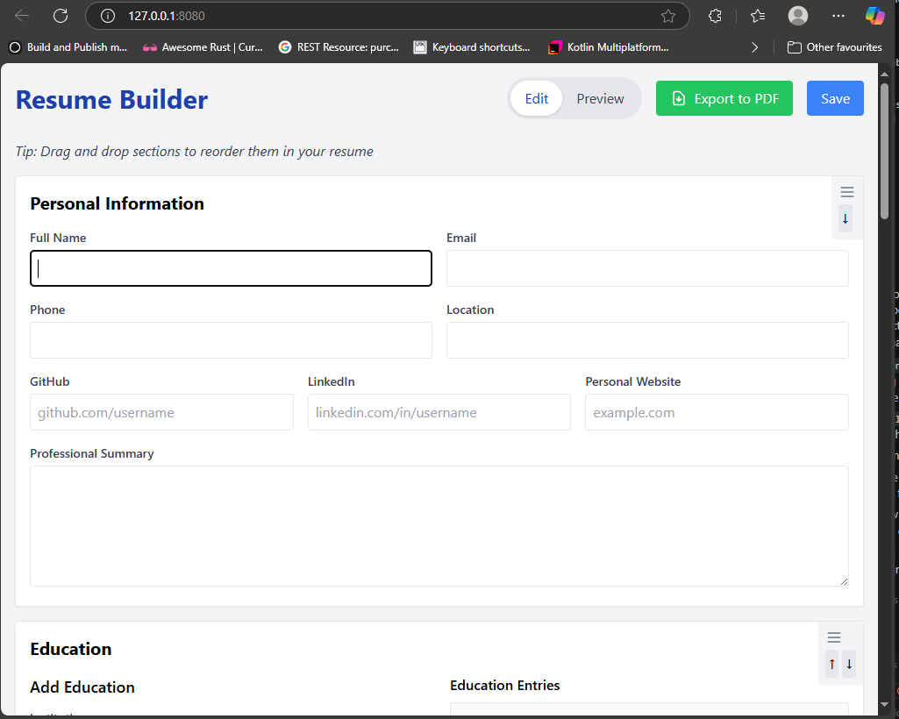
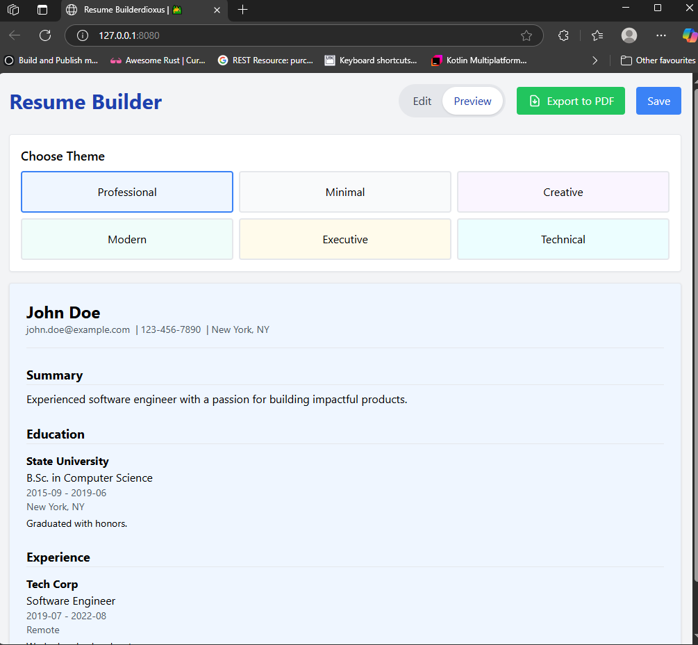

# Resume Builder

A Rust web application built with Dioxus Framework that helps users create professional resumes.

## Screenshots





## Features

- Create professional resumes with multiple sections
  - Personal Information
  - Education
  - Work Experience
  - Skills
  - Projects
- Choose from various resume themes
- Preview your resume before exporting

## Getting Started

### Prerequisites

- Rust (latest stable version)
- Cargo

### Installation

1. Clone the repository:

```bash
git clone https://github.com/yourusername/ResumeBuilder.git
cd ResumeBuilder
```

2. Run the application:

```bash
cargo run
```

Alternatively, to run in development mode with hot reloading:

```bash
cargo install dioxus-cli
dx serve
```

### Building for Web

To build for web deployment:

```bash
cargo build --release --features web
```

## Project Structure

- `src/main.rs` - Main application code
- `index.html` - HTML template
- `tailwind.css` - Styling

## Technologies Used

- [Rust](https://www.rust-lang.org/)
- [Dioxus](https://dioxuslabs.com/) - React-like framework for Rust
- [Tailwind CSS](https://tailwindcss.com/) - For styling

## License

MIT 